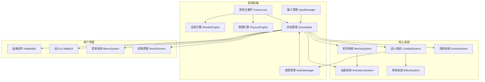

# 像素风机甲对战游戏 - 技术架构文档

## 1. 架构设计



## 2. 技术选型

### 2.1 前端框架
| 技术 | 版本 | 用途 |
|------|------|------|
| React | 18.x | UI组件框架 |
| TypeScript | 5.x | 类型安全 |
| Vite | 5.x | 构建工具 |
| TailwindCSS | 3.x | 样式系统 |
| Zustand | 4.x | 状态管理 |

### 2.2 游戏引擎
- **自研轻量级引擎**: 基于Canvas 2D Context
- **游戏循环**: requestAnimationFrame实现60FPS
- **物理系统**: 自定义AABB碰撞检测 + 简单重力模拟
- **渲染系统**: 分层渲染(背景层、游戏层、UI层)

### 2.3 音频方案
- **Web Audio API**: 音效播放
- **HTML5 Audio**: 背景音乐
- **音效合成**: 使用Web Audio API合成复古8-bit音效

## 3. 项目结构

```
mecha-battle-game/
├── public/
│   ├── assets/
│   │   ├── sprites/          # 精灵图资源
│   │   ├── audio/            # 音效和音乐
│   │   └── backgrounds/      # 背景图片
│   └── index.html
├── src/
│   ├── core/                   # 核心游戏引擎
│   │   ├── GameLoop.ts       # 游戏主循环
│   │   ├── RenderEngine.ts   # 渲染引擎
│   │   ├── PhysicsEngine.ts  # 物理引擎
│   │   └── AssetManager.ts   # 资源管理
│   ├── entities/               # 游戏实体
│   │   ├── Mecha.ts          # 机甲基类
│   │   ├── PlayerMecha.ts    # 玩家机甲
│   │   └── Projectile.ts     # 飞行道具
│   ├── systems/                # 游戏系统
│   │   ├── CombatSystem.ts   # 战斗系统
│   │   ├── AnimationSystem.ts# 动画系统
│   │   ├── EffectSystem.ts   # 特效系统
│   │   └── InputManager.ts   # 输入管理
│   ├── ui/                     # UI组件
│   │   ├── HealthBar.tsx       # 血条组件
│   │   ├── BattleUI.tsx        # 战斗界面
│   │   ├── MenuScreen.tsx      # 菜单界面
│   │   └── ResultScreen.tsx    # 结果界面
│   ├── hooks/                  # 自定义Hooks
│   │   ├── useGameLoop.ts
│   │   ├── useInput.ts
│   │   └── useAudio.ts
│   ├── stores/                 # 状态管理
│   │   └── gameStore.ts        # 游戏状态
│   ├── types/                  # 类型定义
│   │   └── index.ts
│   ├── utils/                  # 工具函数
│   │   ├── constants.ts
│   │   └── helpers.ts
│   ├── App.tsx
│   └── main.tsx
├── .trae/
│   └── documents/
│       ├── PRD.md
│       └── TechSpec.md
├── package.json
├── tsconfig.json
├── vite.config.ts
└── tailwind.config.js
```

## 4. 核心类设计

### 4.1 实体类层次
```typescript
// 基础实体
interface Entity {
  id: string;
  position: Vector2D;
  velocity: Vector2D;
  size: Size;
  update(deltaTime: number): void;
  render(ctx: CanvasRenderingContext2D): void;
}

// 机甲基类
abstract class Mecha implements Entity {
  // 基础属性
  health: number;
  maxHealth: number;
  attackPower: number;
  defense: number;
  speed: number;
  jumpForce: number;
  
  // 状态
  state: MechaState; // IDLE, WALK, JUMP, ATTACK, DEFEND, HIT, DEAD
  isGrounded: boolean;
  isDefending: boolean;
  facingRight: boolean;
  
  // 动画
  currentAnimation: Animation;
  animationTimer: number;
  
  // 输入缓冲
  inputBuffer: InputCommand[];
  
  // 方法
  abstract update(deltaTime: number): void;
  abstract render(ctx: CanvasRenderingContext2D): void;
  abstract attack(): void;
  abstract defend(active: boolean): void;
  abstract jump(): void;
  abstract takeDamage(amount: number): void;
}
```

### 4.2 核心系统类
```typescript
// 游戏主循环
class GameLoop {
  private lastTime: number;
  private isRunning: boolean;
  private accumulator: number;
  private readonly timeStep: number = 1000 / 60; // 60 FPS
  
  constructor(
    private update: (deltaTime: number) => void,
    private render: () => void
  ) {}
  
  start(): void;
  stop(): void;
  private loop(currentTime: number): void;
}

// 物理引擎
class PhysicsEngine {
  private entities: Entity[];
  private gravity: number = 0.8;
  private friction: number = 0.85;
  
  update(deltaTime: number): void;
  checkCollision(a: Entity, b: Entity): boolean;
  resolveCollision(a: Entity, b: Entity): void;
  addEntity(entity: Entity): void;
  removeEntity(entity: Entity): void;
}

// 战斗系统
class CombatSystem {
  private mechas: Mecha[];
  private projectiles: Projectile[];
  private hitEffects: HitEffect[];
  
  update(deltaTime: number): void;
  processAttack(attacker: Mecha, attackType: AttackType): void;
  checkHitBoxes(): void;
  applyDamage(target: Mecha, damage: number, hitPosition: Vector2D): void;
  createHitEffect(position: Vector2D, type: EffectType): void;
}
```

## 5. 状态管理

```typescript
// 游戏状态
interface GameState {
  // 游戏阶段
  phase: GamePhase; // MENU, LOADING, PLAYING, PAUSED, RESULT
  
  // 对战信息
  round: number;
  maxRounds: number;
  timeRemaining: number;
  
  // 玩家数据
  players: {
    [playerId: string]: {
      mechaType: MechaType;
      health: number;
      maxHealth: number;
      energy: number;
      score: number;
      position: Vector2D;
      state: MechaState;
      isDefending: boolean;
      facingRight: boolean;
    };
  };
  
  // 特效和项目
  effects: Effect[];
  projectiles: Projectile[];
  
  // 设置
  settings: {
    masterVolume: number;
    musicVolume: number;
    sfxVolume: number;
    showFPS: boolean;
  };
}

// Zustand Store
const useGameStore = create<GameStore>((set, get) => ({
  state: initialGameState,
  
  // Actions
  startGame: () => set(produce(state => {
    state.phase = 'PLAYING';
    state.timeRemaining = 99;
  })),
  
  updatePlayer: (playerId, updates) => set(produce(state => {
    Object.assign(state.players[playerId], updates);
  })),
  
  dealDamage: (targetId, damage) => set(produce(state => {
    const target = state.players[targetId];
    const actualDamage = target.isDefending ? damage * 0.5 : damage;
    target.health = Math.max(0, target.health - actualDamage);
    
    if (target.health === 0) {
      get().endRound(targetId === 'player1' ? 'player2' : 'player1');
    }
  })),
  
  tick: (deltaTime) => set(produce(state => {
    state.timeRemaining = Math.max(0, state.timeRemaining - deltaTime);
    if (state.timeRemaining === 0) {
      get().endRoundByTime();
    }
  })),
  
  // ... more actions
}));
```

## 6. 输入系统

```typescript
// 输入映射
const INPUT_MAP = {
  player1: {
    left: ['KeyA'],
    right: ['KeyD'],
    up: ['KeyW'],
    down: ['KeyS'],
    attack: ['Space'],
    defend: ['KeyS'],
  },
  player2: {
    left: ['ArrowLeft'],
    right: ['ArrowRight'],
    up: ['ArrowUp'],
    down: ['ArrowDown'],
    attack: ['Enter'],
    defend: ['ArrowDown'],
  },
};

// 输入管理器
class InputManager {
  private keys: Map<string, boolean> = new Map();
  private pressed: Map<string, boolean> = new Map();
  private released: Map<string, boolean> = new Map();
  
  constructor() {
    window.addEventListener('keydown', this.handleKeyDown);
    window.addEventListener('keyup', this.handleKeyUp);
  }
  
  private handleKeyDown = (e: KeyboardEvent) => {
    if (!this.keys.get(e.code)) {
      this.pressed.set(e.code, true);
    }
    this.keys.set(e.code, true);
  };
  
  private handleKeyUp = (e: KeyboardEvent) => {
    this.keys.set(e.code, false);
    this.released.set(e.code, true);
  };
  
  isKeyDown(code: string): boolean {
    return !!this.keys.get(code);
  }
  
  isKeyPressed(code: string): boolean {
    return !!this.pressed.get(code);
  }
  
  isKeyReleased(code: string): boolean {
    return !!this.released.get(code);
  }
  
  getPlayerInput(playerId: string): PlayerInput {
    const map = INPUT_MAP[playerId as keyof typeof INPUT_MAP];
    return {
      left: map.left.some(k => this.isKeyDown(k)),
      right: map.right.some(k => this.isKeyDown(k)),
      up: map.up.some(k => this.isKeyPressed(k)),
      down: map.down.some(k => this.isKeyDown(k)),
      attack: map.attack.some(k => this.isKeyPressed(k)),
      defend: map.defend.some(k => this.isKeyDown(k)),
    };
  }
  
  update(): void {
    this.pressed.clear();
    this.released.clear();
  }
  
  destroy(): void {
    window.removeEventListener('keydown', this.handleKeyDown);
    window.removeEventListener('keyup', this.handleKeyUp);
  }
}
```

## 7. 渲染系统

```typescript
// 渲染层枚举
enum RenderLayer {
  BACKGROUND = 0,
  PLATFORM = 1,
  EFFECTS_BACK = 2,
  ENTITIES = 3,
  EFFECTS_FRONT = 4,
  UI = 5,
}

// 渲染引擎
class RenderEngine {
  private canvas: HTMLCanvasElement;
  private ctx: CanvasRenderingContext2D;
  private layers: Map<RenderLayer, Renderable[]> = new Map();
  private camera: Camera;
  
  constructor(canvasId: string, width: number, height: number) {
    this.canvas = document.getElementById(canvasId) as HTMLCanvasElement;
    this.canvas.width = width;
    this.canvas.height = height;
    this.ctx = this.canvas.getContext('2d')!;
    
    // 禁用抗锯齿保持像素风格
    this.ctx.imageSmoothingEnabled = false;
    
    // 初始化渲染层
    Object.values(RenderLayer).forEach(layer => {
      if (typeof layer === 'number') {
        this.layers.set(layer, []);
      }
    });
    
    this.camera = new Camera(width, height);
  }
  
  addRenderable(renderable: Renderable, layer: RenderLayer): void {
    this.layers.get(layer)!.push(renderable);
  }
  
  removeRenderable(renderable: Renderable, layer: RenderLayer): void {
    const layerArray = this.layers.get(layer)!;
    const index = layerArray.indexOf(renderable);
    if (index > -1) {
      layerArray.splice(index, 1);
    }
  }
  
  clear(): void {
    this.ctx.clearRect(0, 0, this.canvas.width, this.canvas.height);
  }
  
  render(): void {
    this.clear();
    
    // 应用相机变换
    this.ctx.save();
    this.camera.apply(this.ctx);
    
    // 按层渲染
    const sortedLayers = Array.from(this.layers.entries())
      .sort(([a], [b]) => a - b);
    
    for (const [, renderables] of sortedLayers) {
      for (const renderable of renderables) {
        if (renderable.visible) {
          renderable.render(this.ctx);
        }
      }
    }
    
    this.ctx.restore();
  }
  
  resize(width: number, height: number): void {
    this.canvas.width = width;
    this.canvas.height = height;
    this.camera.resize(width, height);
  }
}
```

## 8. 性能优化策略

### 8.1 渲染优化
- 对象池复用粒子特效
- 分层渲染减少overdraw
- 视锥体剔除不可见实体
- 脏矩形优化局部重绘

### 8.2 物理优化
- 空间哈希加速碰撞检测
- 休眠机制冻结静止物体
- 固定时间步长保证稳定性

### 8.3 内存优化
- 纹理图集减少draw call
- 音频流式加载长音乐
- 及时释放不再使用的资源

## 9. 测试策略

### 9.1 单元测试
- 物理计算准确性
- 碰撞检测边界情况
- 状态机转换逻辑

### 9.2 集成测试
- 完整对战流程
- 网络同步(未来扩展)
- 存档加载

### 9.3 性能测试
- 帧率稳定性
- 内存泄漏检测
- 加载时间测试

## 10. 部署方案

### 10.1 构建配置
- Vite生产构建优化
- 代码分割按需加载
- Gzip压缩静态资源

### 10.2 托管方案
- 静态网站托管(CDN)
- 支持HTTPS
- 缓存策略优化
